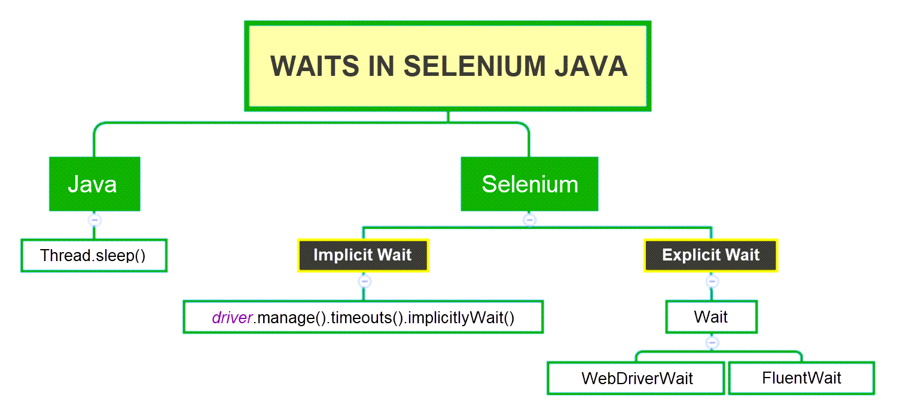

# TC07

switchTo giúp di chuyển giữa các popup/frame/window

# TC09

# 

implicit(a): ngầm hiểu (set cứng)    
explicit(a): rõ ràng (theo đk)

Lớp ExpectedConditions giúp giải quyết các tình huống trong đó chúng ta phải xác định điều kiện xảy ra trước khi thực
thi các step test thực tế.

Lớp ExpectedConditions: các điều kiện mong đợi có thể được truy cập với sự trợ giúp của biến tham chiếu WebDriverWait và
phương thức until().

# 1) elementToBeClickable()

– Điều kiện mong đợi là chờ một phần tử có thể click được, tức là phần tử đó phải hiện diện / được hiển thị trên màn
hình và phải enabled (có thể click).

```
wait.until(ExpectedConditions.elementToBeClickable(By.xpath("//div[contains(text(),'Anh Tester')]")));
Java
```

# 2) textToBePresentInElement()

– Điều kiện mong đợi là chờ một phần tử chứa đoạn text được chỉ định.

```
wait.until(ExpectedConditions.textToBePresentInElement(By.xpath("//div[@id= 'forgotPass'"), "text to be found"));
Java
```

# 3) alertIsPresent()

– Điều kiện mong đợi là chờ một hộp cảnh báo xuất hiện.

```
wait.until(ExpectedConditions.alertIsPresent()) !=null);
Java
```

# 4) titleIs()

– Điều kiện mong đợi là chờ một trang có tiêu đề cụ thể.

```
wait.until(ExpectedConditions.titleIs("Anh Tester - Automation Testing"));
Java
```

# 5) frameToBeAvailableAndSwitchToIt()

– Điều kiện mong đợi là chờ một khung có sẵn (available) và ngay sau khi có khung, điều khiển sẽ tự động chuyển sang nó.

```
wait.until(ExpectedConditions.frameToBeAvailableAndSwitchToIt(By.id("newframe")));
Java
```

# 6) visibilityOfElementLocated()

- được sử dụng để kiểm tra xem một phần tử có tồn tại trong DOM của một trang và hiển thị hay không. Có nghĩa là nó sử
  dụng đối tượng By thay vì đối tượng WebElement với chức năng có thể gọi để tìm phần tử đó trước rồi kiểm tra phần tử
  đó có hiển thị hay không. Chứ nó không tìm kiếm liền.

```
wait.until(ExpectedConditions.visibilityOfElementLocated(By.xpath("//h3[contains(text(),'Website Testing')]")));

driver.findElement(By.xpath("//h3[contains(text(),'Website Testing')]")).click();
Java
```

# 7) visibilityOf()

-được sử dụng để kiểm tra xem một phần tử hiện diện trên DOM của một trang có hiển thị hay không. Có nghĩa là bạn đã tìm
thấy Element đó rồi và chỉ kiểm tra nó có hiển thị hay chưa. Nên tham số nó kiểm tra là 1 đối tượng WebElement chứ không
phải đối tượng By.

```dtd
wait.until(ExpectedConditions.visibilityOf(driver.findElement(By.xpath("//h3[contains(text(),'Website Testing')]"))));

        driver.findElement(By.xpath("//h3[contains(text(),'Website Testing')]")).click();
        Java
```

# 8) presenceOfElementLocated()

- được sử dụng để kiểm tra xem một phần tử hiện có tồn tại trong DOM của một trang hay không. Có nghĩa là bạn đã tìm
  thấy Element đó rồi nhưng nó có thể chưa hiển thị lên. (có thể nó dị disable, nhưng nó vẫn có tồn tại trong DOM)

```
wait.until(ExpectedConditions.presenceOfElementLocated(By.xpath("//h3[contains(text(),'Website Testing')]")));

driver.findElement(By.xpath("//h3[contains(text(),'Website Testing')]")).getAttribute("value");
Java
```